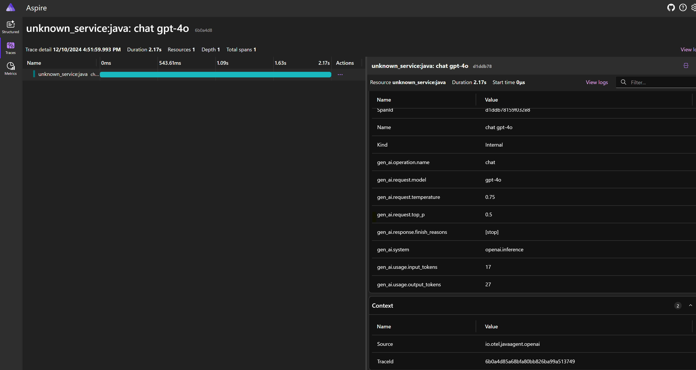

# openai-java-instrumentation - Prototype

A prototype to instrument the official `com.openai:openai-java-0.7` library to collect and export telemetry data using OpenTelemetry Java SDK.

The objective of this prototype is to gather foundational knowledge so official instrumentation can be added to "opentelemetry-java-instrumentation" [repository](https://github.com/open-telemetry/opentelemetry-java-instrumentation).

## How to run:

- Clone the repository.
- From the terminal switch the directory `openai-java-0.7-agent` where the repository is cloned.
  - Run the command `mvn package`
  - This will create a shaded agent jar file in the target directory - `original-openai-java-0.7-agent-1.0-SNAPSHOT-shaded.jar`
-  Run Aspire Dashboard locally that can listen for telemetry data and offer a UI for viewing the collected data. Execute the following docker command to launch the dashboard -:
    - `docker run --rm -p 18888:18888 -p 4317:18889 -p 4318:18890 --name aspire-dashboard mcr.microsoft.com/dotnet/nightly/aspire-dashboard:latest`
    - The output of the docker command includes a link to the dashboard. Open the link in a browser to view the dashboard.
- Configure as below and run the console app in the directory `openai-java-sample` that uses official `com.openai:openai-java-0.7` library to make chat completion api calls to Azure.
  - Set the following environment variables -
    - `AZURE_OPENAI_ENDPOINT` as Azure OpenAI endpoint (e.g. `https://<host-name>.openai.azure.com`)
    - `OPENAI_API_KEY` as OpenAI API key
    - `OTEL_EXPORTER_OTLP_TRACES_ENDPOINT` as `http://localhost:4317`
  - Set the VM option `-javaagent` as path to the shaded agent jar file
      - e.g. `-javaagent:"C:\code\openai-java-instrumentation\openai-java-0.7-agent\target\original-openai-java-0.7-agent-1.0-SNAPSHOT-shaded.jar"`
 - Navigate to the Aspire Dashboard, look under "Traces" tab to view the traces.

